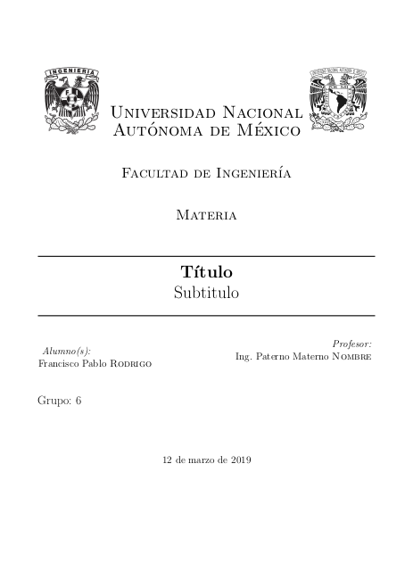
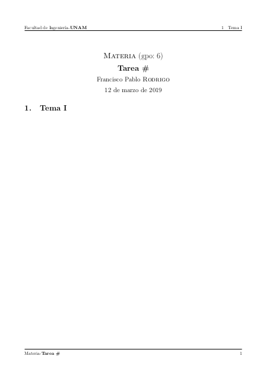

# LaTeX Templates
En este repositorio se encuentran algunas plantillas de LaTeX que pueden usarse para reportes de la facultad, borradores de artículos o ensayos, entre otras cosas.

## Algunos ejemplos

### Reporte de laboratorio 

### Reporte de laboratorio 

### Reporte de laboratorio 

### Reporte de laboratorio 

