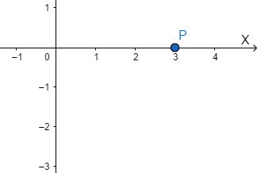
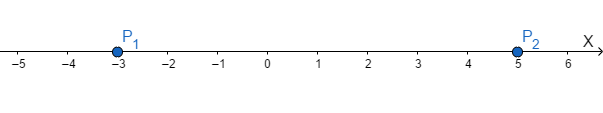
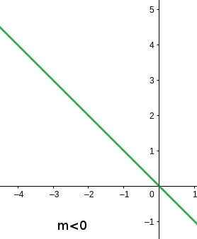
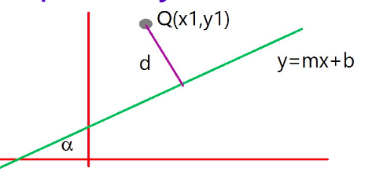

# Geometría Analítica

La geometría Analítica es el estilo de la geometría descrita a través de ciertas expresiones matemáticas.

[TOC]

## Conceptos básicos de la geometría analítica

### La recta numérica

La recta numérica es un elemento matemático en el cual a una recta se le asocia un elemento geométrico (el punto) con el elemento algebraico (un número).

### Espacio de dimensión $n$

Un espacio de $n$ dimensiones se define como un conjunto de puntos asociados con un conjunto de números reales ordenados, es decir 
$$
E^n=P(x_1, x_2, x_3,..., x_n)  \hspace{0.5cm}\mbox{con}\hspace{0.5cm} n=1,2,3...
$$
El campo de estudio de la geometría analítica es el espacio, existen espacios de $n$ dimensiones. Nuestro estudio se centra en el espacio de dos dimensiones, generalmente conocido como plano.

### Sistema coordenado

Un sistema de coordenadas o coordenado es una referencia para situar puntos a través de dar una eneada de números, por ejemplo, $(x_1, x_2, ..., x_n)$ en donde $n$ es la dimensión del espacio en donde estemos trabajando.

El sistema en el que vamos a estar trabajando se conoce como plano y es un espacio de dos dimensiones.

#### Pasos para ubicar un punto en el plano cartesiano

Como ejemplo ubiquemos el punto $P(3,-2)$, recuerda que este punto tiene la forma $p(x,y)$ y la $x$ y la $y$ corresponden a los ejes del plano cartesiano.

* La primera coordenada (en nuestro caso el 3) corresponde al eje de las $x$, por lo cual, si
  * Es positiva nos movemos  $x$ unidades (para nuestro caso, 3 unidades) a la derecha del cero.
  * Es negativa nos movemos $x$ unidades a la izquierda del cero.

* La segunda coordenada (en nuestro caso el $-2$) corresponde al eje de las $y$ , por lo cual, si
  * Es positiva nos movemos  $y$ unidades hacia arriba del cero.
  * Es negativa nos movemos $y$ unidades (para nuestro caso, $-2$ unidades) hacia abajo del cero.

* Traza líneas punteadas que pasen por el $3$ y por el $-2$

* El punto donde se intersecten las líneas punteadas es el punto $P$

#### Ejercicios

Ubicar los siguientes puntos en el plano cartesiano 

* $A(1,3)$ 
* $B(-2,4)$
* $C(-1,-2)$
* $D(5,-3)$
* $E(1,0)$
* $F(0,1)$
* $G(0,-1)$
* $H(-1,0)$

### Distancia entre dos puntos

#### Distancia entre dos puntos en el espacio de una dimensión (R)

¿Cuál es el número de unidades que hay entre el punto $p_1$ y el punto $p_2$?

Para representar la distancia entre el punto uno y el punto dos utilizamos la siguiente notación $d(p_1,p_2)$

Además, en la recta numérica, se observa que $d(p_1,p_2)=d(p_2,p_1)$

La expresión que nos permite calcular la distancia entre dos puntos, es decir, $d(p_1,p_2)$ ,esta dada por
$$
d(p_1,p_2)=|x_2-x_1|
$$

##### Ejemplo 1 

Halla la distancia entre los puntos $A(5)$ y $B(-3)$

*Solución*
$$
\begin{align}
	d(A,B) &= |x_2-x_1|\\
	&= |5-(-3)| \\
	&= |8| \\
	d(A,B) &= 8
\end{align}
$$

#### Distancia entre dos puntos en el espacio de dos dimensiones ($R^2$)

Sean 2 puntos del plano cartesiano, es decir
$$
p_1(x_1,y_1)\space y \space  p_2(x_2,y_2)\in R^2
$$
{http://www.profesorenlinea.cl/geometria/Distancia_entre_dos_puntos.html}

Es posible calcular la su distancia a través de la siguiente expresión. 
$$
\fbox{$d(p_1,p_2) = \sqrt{(x_2-x_1)^2+(y_2-y_1)^2} $}\hspace{2cm}\cdots(1)
$$
Dicha expresión se puede **demostrar** simplemente utilizando el teorema de Pitágoras. 

##### Ejemplo 1

Encontrar la longitud del segmento que une a los puntos $p(-3,-4)\space y\space q(2,9)$.

*Solución*

Podemos empezar diciendo que $p_1$ es $p$ y $p_2$ es $q$ , entonces:
$$
p_1(x_1,y_1) = p(-3,-4) \Rightarrow x_1 = -3, \space y_1 = -4 \\
p_2(x_2,y_2) = q(2,9) \Rightarrow x_2 = 2, \space y_2 = 9
$$
Usando *(1)*
$$
\begin{eqnarray}
	d(p,q) = \sqrt{(2-(-3))^2+(9-(-4))^2} = \sqrt{194} 
\end{eqnarray}
$$

##### Observación

Si queremos calcular la longitud del un segmento de recta que es **paralelo** al eje de las $x$ podemos simplemente utilizar
$$
d(p_1,p_2)=|x_2-x_1|
$$
Ya que las coordenadas para $y$ al ser la mismas se cancelan en la expresión *(1)*

Lo mismo sucesde si se desea calcula la longitud de un segmento que es **paralelo** al eje de las $y$
$$
d(p_1,p_2)=|y_2-y_1|
$$

#### Ejercicios

1. ¿Cuál es la distancia que existen entre los puntos $P_1(-5)$ y $P_2(7)$ ?

2. Hallar la distancia del punto $A(1,-3)$ al punto $B(4,-2)$.

3. Hallar $d(BA)$ si $A(1,2)$ y $B(10,0)$.

4. Encontrar la distancia entre los punto $P(0,-8)$ y $Q(3,-8)$.

5. Encuentra la distancia entre los siguientes pares de puntos. 

   a. $A(-1,0)$, $B(0,9)$

   b. $P(7,-7)$, $Q(12,-1)$

   c. $E(3,-4)$, $R(2,-8)$

6. Calcular $d(AB)$ si $A(\sqrt{2},3)$ y $B(\frac{1}{3},-1)$

7. Calcular $d(AB)$ si $A(-2\sqrt{2},-3)$ y $B(\frac{\sqrt{2}}{3},6)$

8. Calcula el perímetro del siguiente triángulo, de vértices $A(-1,3)$, $B(7,-8)$ y $C(-2,2)$

9. Calcula el perímetro del siguiente triángulo, de vértices $A(1,-3)$, $B(5,0)$ y $C(6,9)$

10. Los extremos del diámetro de una circunferencia son $R(1,-2)$ y $Q(7,9)$. Calcule el perímetro y área de dicha circunferencia.

### Coordenadas de un punto que divide a un segmento de acuerdo con una razón dada 

#### División de un segmento en una razón dada en $R$

Sean los puntos $A(x_1),\;B(x_2),\;P(x)$ a partir de los cuales se generan los siguientes segmentos:  $\overline{AB}$ , $\overline{AP}$ y $\overline{PB}$

Podemos comparar el segmento $\overline{AP}$ y $\overline{PB}$  con lo que obtenemos una razón, como se sigue
$$
r =\dfrac{\overline{AP}}{\overline{PB}} \hspace{2cm}\cdots(1)
$$
De lo anterior se puede concluir que la razón se calcula como 
$$
r =\dfrac{x-x_1}{x_2-x} \hspace{2cm}\cdots(2)
$$
Si de *(2)* se despeja $x$ que representa la coordenada que divide al segmento
$$
x = \dfrac{x_1+rx_2}{r+1} \hspace{2cm}\cdots(3)
$$
Al dividir el segmento existen 4 posibles casos de la posición de $p$ con respecto del segmento

1. El punto $P$ se encuentra entre $A$ y $B$
2. $P=A$
3. El punto $P$ esta antes que $A$ o después de $B$ 
4. $P=B$ (No está definido)

##### Ejemplo 1

Hallar $R(x)$ que divide al segmento $\overline{PQ}$ con extremos $P(-4)$ y $Q(8)$ en la razón $r=\dfrac{3}{5}$

*Solución* 

Utilizando *(3)*
$$
x_1 = -4 \\
x_2 = 8 \\ 
r = \dfrac{3}{5} \\
\begin{align}
	\Rightarrow x &=\dfrac{-4+\left(\dfrac{3}{5}\right)8}{\dfrac{3}{5}+1} \\[5mm]
	&= \dfrac{-4+\dfrac{24}{5}}{\dfrac{3}{5}+\dfrac{5}{5}} \\[5mm]
	&= \dfrac{-4\left(\dfrac{5}{5}\right)+\dfrac{24}{5}}{\dfrac{3}{5}+\dfrac{5}{5}} \\[5mm]
	&= \dfrac{\dfrac{-20}{5}+\dfrac{24}{5}}{\dfrac{3}{5}+\dfrac{5}{5}} \\[5mm]
	&= \dfrac{\dfrac{-20+24}{5}}{\dfrac{3+5}{5}} \\[5mm]
	&= \dfrac{4}{8} \\[5mm]
	\therefore \fbox{$x = \dfrac{1}{2}$}
\end{align}
$$

#### División de un segmento en una razón dada en $R^2$

Similar a los que paso en $R$ , se tienen tres puntos $A(x_1,y_1),\;B(x_2,y_2),\;P(x,y)$ a partir de los cuales se generan los siguientes segmentos:  $\overline{AB}$ , $\overline{AP}$ y $\overline{PB}$

En donde la expresión para calcular la razón es
$$
r =\dfrac{x-x_1}{x_2-x} = \dfrac{y-y_1}{y_2-y} \hspace{2cm}\cdots(1)
$$
Y para encontrar las coordenadas de $P$ se tiene

Para $x$ 
$$
x = \dfrac{x_1+rx_2}{r+1} \hspace{2cm}\cdots(2)
$$
Para $y$
$$
y = \dfrac{y_1+ry_2}{r+1} \hspace{2cm}\cdots(3)
$$

##### Ejemplo 1

Encontrar las coordenadas del punto $R$ , en el segmento que une a $P(3,-2)$ y $Q(-5,1)$ de tal manera que $\dfrac{\overline{PR}}{\overline{PQ}}= \dfrac{3}{4}$

*Solución*
$$
\begin{align}
	\dfrac{\overline{PR}}{\overline{PQ}} &= \dfrac{3}{4} \\[5mm]
	\dfrac{\overline{RQ}}{\overline{PR}} &= \space? \\[5mm]
	\dfrac{\overline{PR}}{\overline{PR+RQ}} &= \dfrac{3}{4} \\[5mm]
	\dfrac{\overline{PR}+\overline{RQ}}{\overline{PR}} &= \dfrac{4}{3} \\[5mm]
	\dfrac{\overline{PR}}{\overline{PR}} +\dfrac{\overline{RQ}}{\overline{PR}} &= \dfrac{4}{3} \\[5mm]
	1 +\dfrac{\overline{RQ}}{\overline{PR}} &= \dfrac{4}{3} \\[5mm]
	\dfrac{\overline{RQ}}{\overline{PR}} &= \dfrac{1}{3} \\[5mm]
\end{align} \\[10mm]
\mbox{Ahora, podemos calcular las coordenadas } x \mbox{ y } y \mbox{ cuyo cálculo se le deja al lector.}
$$

#### Ejercicios

1. ¿Cuál es la razón que divide el segmento de recta con extremos $P_1(-3,-6)$ y $P_2(-1,7)$ en el punto $P(10,4)$?
2. Determina el punto $P(x,y)$ que divide al segmento $\overline{P_1P_2}$ en una razón $r=\frac{2}{3}$, si $P_1(3,-5)$ y $P_2(-1,-4)$.

### Área de un polígono 

Existen varios métodos para encontrar el área de un polígono, a continuación se expone el método por triángulación.

El área de un polígono de $n$ vértices colocados en el plano se puede calcular por medio del siguiente determinante.
$$
A_p = \frac{1}{2}
\left|
\begin{array}{cc}
	x_1 & y_1 \\
	x_2 & y_2 \\
	\vdots  & \vdots \\ 
	x_n & y_n \\
	x_1 & y_1
\end{array}
\right| \hspace{2cm}\cdots(1)
$$
**Observa que la primera coordenada se repite al final.**

**Observe que el orden de las coordenadas tiene que ser en sentido *retrogrado* para que no obtengamos áreas negativas.**

#### Ejemplo 1

Encontrar el área del triángulo cuyos vértices son $A(-1,-2),\;B(1,4),\;C(2,2)$

*Solución*
$$
A_t = \frac{1}{2}
\left|
\begin{array}{cc}
	-1 & -2 \\
	2 & 2 \\
	1 & 4 \\
	-1 & -2
\end{array}
\right| \\
\begin{align}
	A_t & = \dfrac{1}{2} \left[(-2+8-2)-(-4+2-4)\right] = 5
\end{align}
$$

#### Ejercicios

1. Hallar el área del polígono de vértices $A(1,1)$, $B(2,-3)$, $C(-3,-3)$, $D(-4-1)$ y $E(-2,1)$.

### Conceptos de básicos de la línea recta

Antes de iniciar formalmente con el estudio de la recta es importante aprender algunos conceptos que nos  permitirán dar una definición de lo que es un recta.

#### Ángulo de inclinación de una recta ($\ell$)

El ángulo de inclinación de  $\ell$ es un ángulo $\alpha$ en posición normal cuyo lado terminal coincide con la recta $\ell$

El ángulo tiene la siguiente restricción
$$
0 \leq \alpha \leq 180°
$$

#### Pendiente de una recta

La pendiente (m) de una recta $\ell$ es la tangente trigonométrica de su ángulo de inclinación.

En palabras más sencillas, la pendiente de una recta mide la inclinación de una recta.
$$
tan\, \alpha = m \hspace{2cm}\cdots(1)
$$
Es posible obtener el valor de la pendiente de una recta $\ell$ si se conocen dos puntos fijos por donde ésta pasa.Es decir

{http://matematicatuya.com/GRAFICAecuaciones/S4.html}

Sean $p_1(x_1,y_1) $ y $p_2(x_2,y_2)$ puntos de $\ell$ 

Por el teorema  de Pitágoras se puede demostrar que 
$$
m = \dfrac{\Delta y}{\Delta x} = \dfrac{y_2-y_1}{x_2-x_1} \hspace{2cm}\cdots(2)
$$

#### Casos posibles de la pendiente (m)

- Cuando la pendiente es positiva

  

- Cuando la pendiente es negativa

  

- Cuando la pendiente es cero

  

- Cuando la pendiente no existe

  

##### Ejemplo

Hallar la pendiente del segmento de recta $\overline{P_1P_2}$  si $P_1(1,3)$ y $P_2(7,-8)$.

*Solución*
$$
m= \dfrac{-8-3}{7-1}=\dfrac{-11}{6}\\
\therefore \fbox{$m_{\overline{P_1P_2}} = \dfrac{-11}{6}$}
$$

#### Ejercicios

### Ángulo entre dos rectas

Es posible calcular el ángulo que existe entre dos rectas $\ell_1$ y $\ell_2$ de la siguiente manera
$$
tan\, \theta = \dfrac{m_2-m_1}{1+m_1m_2} \hspace{2cm}\cdots(1)
$$
en donde $m_1$ es la pendiente de la recta $\ell_1$ y $m_2$ es la pendiente de la recta $\ell_2$

#### Ejemplo 1

Calcular los ángulos internos del triángulo $\triangle \over{ABC}$  cuyos vértices son los puntos $A(4,0),\;B(1,4),\;C(-1,-1)$

### Condicionales de paralelismo 

Dos rectas son paralelas si entre ellas no se puede formar un ángulo es decir $\theta = 0°$

De la expresión de ángulo entre dos rectas, tenemos
$$
tan\, \theta = \dfrac{m_2-m_1}{1+m_1m_2} \\[10mm]
\mbox{Si hacemos que } \theta = 0° \\
\Rightarrow tan\, 0° = \dfrac{m_2-m_1}{1+m_1m_2} = 0 \\
\dfrac{m_2-m_1}{1+m_1m_2} = 0 \\
m_2-m_1 = 0 \\
\therefore m_1 = m_2
$$
**En conclusión, dos rectas $\ell_1$ y $\ell_2$ son paraelas si sus pendientes son iguales **

i.e. 
$$
\fbox{$\ell_1 \parallel \ell_2 \Leftrightarrow m_1 = m_2$} \hspace{2cm}\cdots(1)
$$

### Condición de perpendicularidad

Dos rectas son perpendiculares si  entre ellas se forma un ángulo de 90°

De la expresión de ángulo entre dos rectas, tenemos
$$
tan\, \theta = \dfrac{m_2-m_1}{1+m_1m_2} \\[10mm]
\mbox{Si hacemos que } \theta = 90° \\
\Rightarrow tan\, 90° = \dfrac{m_2-m_1}{1+m_1m_2}  \nexists \\
$$
Sabemos que $tan\, 90° $ no esta definida, la única forma de lograr una indeterminación en un cociente es  que el divisor sea cero, entonces al provocar la indeterminación se tiene que 
$$
1+m_1m_2 = 0 \\
m_1m_2 = -1
$$
**En conclusión, dos rectas $\ell_1$ y $\ell_2$ son perpendiculares si el producto de sus pendientes da -1**

i.e. 
$$
\fbox{$\ell_1 \bot \ell_2 \Leftrightarrow m_1m_2=-1$} \hspace{2cm}\cdots(1)
$$

### Lugar geométrico

Se le llama lugar geométrico a un conjunto de puntos que cumplen cierta definición, llamada regla de correspondencia.

#### Ejemplo 1

Hallar el lugar geométrico de todos los puntos que equidistan de los puntos fijos $A(5,3) \space y \space B(2,-5)$

*Solución*

#### Ejemplo 2

Hallar el lugar geométrico de todos los puntos que se encuentran a $6$ unidades del punto $A(-3,2)$

## Recta

### La recta como lugar geométrico

La recta se define como el lugar geométrico de un punto $p(x,y)$ que se mueve de tal manera que la pendiente entre dos o más posiciones permanece constante. 

{https://oa.ugto.mx/oa/oa-enmsir-0000001/2_formas_de_la_ecuacin_de_la_recta.html}

En otras palabras, si se definen dos puntos fijos A y B que pertenecen a un recta $\ell$ y se calculan las pendiente de los segmentos $\overline{AP}$ y $\overline{PB}$  se llega a la siguiente conclusión
$$
m_{\overline{AP}}=m_{\overline{PB}} = k
$$

### Formas de la ecuación de la recta

Desde ahora es importante aclarar que las formas de la recta mostradas a continuación pueden fácilmente ser transformadas a otras, por ejemplo, **se puede cambiar de la forma punto- pendiente a la forma general y viceversa.**

#### Forma punto-punto

Sean $A(x_1, y_1)$ y $B(x_2, y_2)$ dos puntos que pertenecen a la recta $\ell$, y $p(x,y)$ un punto que se mueve a lo largo de la recta.

Por definición de línea recta 
$$
\begin{align}
	m_{\overline{AP}} &= m_{\overline{PB}} \\[2mm]
	\dfrac{y-y_1}{x-x_1} &= \dfrac{y_2-y_1}{x_2-x_1} 
\end{align}
$$
Si pasamos multiplicando el denominador de $m_{\overline{AP}}$ obtenemos la **ecuación de la recta punto-punto**
$$
\fbox{$y-y_1=\left(\dfrac{y_2-y_1}{x_2-x_1}\right)(x-x_1)$} \hspace{2cm}\cdots(1)
$$

#### Forma punto-pendiente

A partir de la ecuación de la forma punto a punto (1), se observa lo siguiente
$$
y-y_1=\underbrace{\left(\dfrac{y_2-y_1}{x_2-x_1}\right)}_{m}(x-x_1) \\
y-y_1=m(x-x_1) \\
$$
En otras palabras, si conocemos la pendiente de la recta $\ell$ y un punto fijo $p_1(x_1,y_1)$ de la misma basta con utilizar la **forma punto-pendiente**.
$$
\fbox{$y-y_1=m(x-x_1) $} \hspace{2cm}\cdots(2)
$$

#### Forma pendiente ordenada

Sea $m$ la pendiente de una recta $\ell$   y sea $B(0,b)$ un punto que es ordenada al origen de la recta (es decir, la intersección con el eje $y$ ).

A partir de *(2)* tenemos lo siguiente
$$
\begin{align}
	y-y_1 &= m(x-x_1) \\
	y-b &= m(x-0) \\
	y-b & = mx
\end{align} \\
\therefore \fbox{$y = mx+b$}  \hspace{2cm}\cdots(3)
$$

##### Ejemplo

Hallar la ecuación de la recta que pasa por los puntos $A(2,3)$ y $B(1,-5)$ y expresarla en su forma punto-pendiente.

*Solución*
$$
\begin{align}
\mbox{Con (1), se tiene que }\\
y-3 &= \left(\dfrac{-5-3}{1-2}\right)(x-2) \\
y-3 &= \left(-8\right)(x-2) \\
y-3 &= -8x+16  \\
y &= -8x+19
\end{align}
$$

#### Forma general

La forma general de la recta se refiere a una ecuación de primer grado que tiene la forma
$$
Ax+By+C = 0  \hspace{2cm}\cdots(4)
$$
**Siempre tenemos que hace que este igualada con cero**

**Fórmulas para obtener la pendiente $m$ y la ordenada al origen $b$ a partir de la ecuación general**

//falta

##### Ejemplo

Halla la ecuación de la recta que pasa por el punto $P(7,1)$ y cuya pendiente es de $m=\frac{1}{2}$. Expresar dicha ecuación en su forma general.

*Solución*
$$
\begin{align}
\mbox{Con (4), se tiene que }\\
y-1 &= \left(\dfrac{1}{2}\right)(x-7) \\
2(y-3) &= \left(1\right)(x-2) \\
2y-6 &= x-2 \\
\mbox{En su forma general ...} \\
2y-6-x+2 &= 0 \\
\fbox{$2y-x-4 = 0 $}\\
\end{align}
$$

### Distancia de un punto $p(x_1,y_1)$ a una recta $Ax+By+C = 0 $

Es posible calcula la distancia de un punto $p$ a una recta $\ell : Ax+By+C =0$ a través de la siguiente expresión
$$
\fbox{$d(p,\ell) = \dfrac{|Ax_1+By_1+C|}{\sqrt{A^2+B^2}}$} \hspace{2cm}\cdots(1)
$$
**Recuerde que con *(1)* obtendremos la longitud de un segmento de recta trazado a partir del punto $p$ y cuyo extremo es un punto que se encuentra en $\ell$ . Dicho segmento es siempre perpendicular a la recta por tratarse de un distancia. En la siguiente figura se expresa lo anteriormente dicho.**

#### Ejemplo

Hallar la distancia de desde la recta $\ell: 3x+y=0$ al punto $A(-2,-3)$.

*Solución*
$$
\mbox{Con (1)}\\[0.5cm]
\begin{align}
d(A,\ell) &= \dfrac{|3(-2)+1(-3)|}{\sqrt{3^2+1^2}} \\
d(A,\ell) &= \dfrac{|-9|}{\sqrt{10}} \\
\end{align} \\
\fbox{$d(A,\ell) = \dfrac{9}{\sqrt{10}}$}
$$

### Ecuación de las bicectrices de un ángulo entre dos rectas

### Ecuaciones de las medianas, mediatrices y alturas y un triángulo. 

#### Puntos de intersección (ortocentro, circuncentro y baricentro) 

## Secciones cónicas

## Ecuación general de segundo grado

## Criterio del discriminante

## Parábola

La parábola es el lugar geométrico $P$ que se mueve en el plano de tal manera que equidista siempre de un punto fijo llamado *foco* $F$ y de una recta fija $\ell$ llamada *directriz*.

i.e.
$$
d(F,P) = d(P,\ell)
$$

### Elementos de la parábola

$$
\begin{align}
	F &: foco \;\mbox{(un punto)} \\
	DD' &: \;\mbox{Directriz}  \\
	v & : \;\mbox{Vértice de la parábola}\\
	EE´&: \;\mbox{Eje de simetría} \\
	\overline{LR} &: \;\mbox{Lado recto} \\
	p &: \;\mbox{Parámetro} \\
	A &: \;\mbox{Punto de referencia}	
\end{align}
$$

Además se cumple que,
$$
EE' \;\bot\; DD' \\
p = |\overline{AV}| = |\overline{VF}| \\
\overline{LR} = 4p
$$
El lado recto es una cuerda focal perpendicular al eje de simetría  y mide que tan ancha es la parábola desde el foco.

### Casos de la parábola

Existen básicamente cuatro casos en que podríamos encontrar la gráfica de un parábola.

{https://iguerrero.wordpress.com/2009/10/20/topicos-de-geometria-analitica-30/}

1. Cuando la parábola es vertical y es positiva
2. Cuando la parábola es vertical y es negativa
3. Cuando la parábola es horizontal y es positiva
4. Cuando la parábola es horizontal y es negativa

### Ecuaciones de la parábola 

#### Ecuación canónica (estándar, ordinaria o cartesiana) de la parábola

##### Parábola Horizontal Positiva  o negativa con Vértice en el Origen (PHP/N-VO)

##### Parábola Vertical Positiva  o negativa con Vértice en el Origen (PVP/N-VO)

##### Parábola Horizontal Positiva  o negativa con Vértice en $(h,k)$ (PHP/N-VHK)

##### Parábola Vertical Positiva  o negativa con Vértice en $(h,k)$ (PHP/N-VHK)

#### Ecuación general de la parábola

## Circunferencia

La circunferencia es el lugar geométrico de un punto $P$ que se mueve en el plano de tal manera que su distancia a un punto fijo, llamado *centro* $C$, permanece contante y corresponde al rado $\rho$

i.e.
$$
r = d(C,P)
$$

## Elipse

## Hipérbola

## Translación de ejes